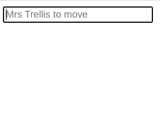
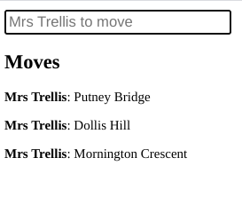

In the [previous step](./storeIntroduction.md) we created a Store with the state of our Mornington Crescent game. Now let's render the state to the page.

Lauf provides a `useSelected` hook. It accepts a 'selector function' which retrieves the part of the state your component wants to consume.

The `useSelected` hook subscribes as a Store Watcher. When the Store's state changes, the selector retrieves the data again. A re-render of your component is only triggered if the selected value is not equal to the last time.

In the React component below, we create a Summary view of all the `moves` in the game so far. In the first render, the `useSelected` hook will retrieve the `moves` from the Store and render them. Later, when it is notified that the `moves` array has changed, it will then trigger a further re-render. It won't trigger a re-render for any changes elsewhere in the state tree.

```typescript
function Summary({ store }: Game) {
  const moves = useSelected(store, (state) => state.moves);
  return moves.length === 0 ? null : (
    <>
      <h2>Moves</h2>
      {moves.map((move) => (
        <p>
          <strong>{move.player}</strong>: {move.station}
        </p>
      ))}
    </>
  );
}
```

Let's add a form control to type in the moves. It tracks whose turn it is, and shows this as placeholder text in the text box.

```typescript
function Form({ store, addMove }: Game) {
  const turn = useSelected(store, (state) => state.turn);

  const [text, setText] = useState("");

  const onTextChange = (event: ChangeEvent<HTMLInputElement>) =>
    setText(event.target.value);

  const onSubmit = (event: FormEvent) => {
    event.preventDefault();
    if (text) {
      addMove(text);
      setText("");
    }
  };

  return (
    <form onSubmit={onSubmit}>
      <input
        value={text}
        onChange={onTextChange}
        placeholder={`${turn} to move`}
      />
    </form>
  );
}
```

This shows how the Form's `onSubmit` handler intercepts form submissions, calling `addMove` with the user's input, and clearing the text box.

> This Form follows [React guidance](https://reactjs.org/docs/forms.html) and makes the `<input>` a _controlled component_ - handling each `onChange` by setting the Form's `text` state to whatever the user has typed so far.

Wrapping this up, we create a game component which launches the game, stores the game as state, and binds the two UI controls.

```typescript
export function SimpleGame() {
  const [game] = useState<Game>(() => createGame());

  return (
    <>
      <Form {...{ game }} />
      <Summary {...{ game }} />
    </>
  );
}
```

The final reference source code for this section is shared in [this folder](../../apps/nextjs-mornington/src/tutorial/bind).

It presents a Form allowing us to enter our next move, and shows a Summary of moves so far.

 

Unfortunately, given our current implementation of the game, it is always the turn of 'Mrs Trellis' and the game continues even if she makes a winning move!

In the next section we will introduce 'business logic' processes that run alongside our Store and UI, responding to detected changes and enforcing constraints. This will bring the gameplay closer to the 'original modern' rules of Mornington Crescent.

Next >> [Writing action plans](./actionPlans.md)
